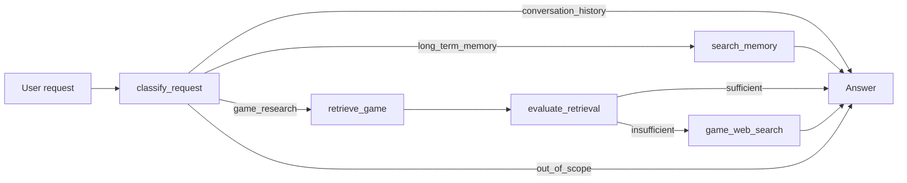

# Game Research Agent: Evidence-Grounded Game Research Agent

[](https://github.com/trzhang-ai/game-research-agent/actions/workflows/quality.yml)

Game Research Agent answers questions about video games using a local game
catalog, web sources, and stored user context. It checks whether retrieved
records support an answer before deciding whether to search the web.

For example, a release-year question can use a catalog record, a follow-up can
reuse the conversation, and a question about the first game in a series may
require additional web evidence. Each tool call and decision is recorded for
inspection.

This Python portfolio project demonstrates retrieval-augmented generation
(RAG): supplying a language model with retrieved evidence to support its
answers. It combines typed API tools, an evidence evaluator, explicit workflow
controls, and two forms of memory. See [project provenance](PROVENANCE.md) for
its course origins and contribution boundaries.

## Architecture



The language model interprets the request and tool inputs, while the state
machine controls which action is possible next. This separates probabilistic
reasoning from deterministic workflow policy.

## Engineering highlights

- **Evidence-gated retrieval:** a Pydantic `EvaluationReport` prevents a
  semantically similar local result from being treated as complete evidence.
- **Controlled fallback:** public-web search is available only after local
  evidence has been evaluated as insufficient.
- **Grounded generation:** the system prompt prohibits factual claims based on
  pretrained knowledge and requires citations for web-derived claims.
- **Two memory scopes:** session history supports follow-up questions, while a
  namespaced Chroma collection provides read-only, user-specific long-term
  context.
- **Deterministic persistence:** UUID5-derived memory IDs and Chroma upserts make
  memory seeding safe to rerun.
- **Typed tool boundary:** Python annotations and docstrings are converted into
  OpenAI-compatible JSON schemas; tool results retain structured data and UTF-8
  characters throughout the execution loop.
- **Auditable orchestration:** every state transition and tool result is retained
  in a run snapshot for inspection.

## API-backed reference run

| Scenario | Observed tool path | Evidence source |
| --- | --- | --- |
| Saved user-specific fact | `classify_request → search_memory` | Long-term memory |
| Pokémon release year | `classify_request → retrieve_game → evaluate_retrieval` | Local game record |
| Follow-up about the same game | `classify_request` | Session history |
| First 3D Super Mario platformer | `classify_request → retrieve_game → evaluate_retrieval → game_web_search` | Local candidates plus cited web evidence |
| Mortal Kombat X platform check | `classify_request → retrieve_game → evaluate_retrieval → game_web_search` | Cited web evidence |
| Cooking question | `classify_request` | Out-of-scope response |

These routes were observed in the successful notebook run preserved at
[`b80e082`](https://github.com/trzhang-ai/game-research-agent/blob/b80e0824c4ebf2b6466b3f44cf332e159d4ea68c/Udaplay_02_solution_project.ipynb),
before the portfolio refactor. Current notebook outputs are cleared so revised
code is not presented beside stale execution results. See
[Validation notes](docs/validation.md) for the current checks, evidence boundary,
and rerun instructions.

## Repository guide

```text
.
├── 01_game_index.ipynb                # Persistent ingestion and semantic retrieval
├── 02_research_agent.ipynb            # Agent assembly and end-to-end scenarios
├── games/                             # 15 illustrative game records
├── lib/                               # Messages, tools, state machine, memory, vector DB
├── long_term_memory.py                # Read-only memory-search tool factory
├── game_agent.py                       # Evidence-gated phase orchestration
├── tests/                             # Deterministic unit and notebook checks
└── docs/validation.md                 # Verification record and limitations
```

## Run locally

The repository is locked to Python 3.14.7 and uses
[uv](https://docs.astral.sh/uv/) for dependency management.

```bash
git clone https://github.com/trzhang-ai/game-research-agent.git
cd game-research-agent
cp .env.example .env
uv sync --locked
uv run python -m unittest discover -s tests -v
```

Add these credentials to `.env` before running the API-backed notebook cells:

```dotenv
OPENAI_API_KEY=replace_me
TAVILY_API_KEY=replace_me
OPENAI_BASE_URL=https://api.openai.com/v1
```

Open the notebooks with the project virtual environment as the kernel and run
`01_game_index.ipynb` first to create the persistent `udaplay` collection, then
`02_research_agent.ipynb` to assemble the agent and its memory collection. Local database
files and credentials are excluded from Git.

The local collection retains its original name, `udaplay`, so existing databases
remain compatible. It is a storage identifier, not the project display name.

## Design constraints

- The bundled game dataset contains only 15 records, so it cannot establish
  catalog-wide absence, uniqueness, rankings, or superlatives by itself.
- LLM-based routing and sufficiency evaluation are probabilistic; the explicit
  state machine constrains actions but does not make model judgments infallible.
- Web results are candidate evidence. Source authority and claim support still
  need evaluation before an answer is accepted.
- Long-term memory is seeded and read-only in the conversational workflow; this
  prototype does not implement consent, retention, or deletion policies for a
  production memory service.
- This is a notebook-led reference implementation, not a deployed application.

## Project provenance

This repository was completed as a Udacity learning project using a supplied
educational scaffold and dataset. The agent routing, retrieval-evaluation gate,
memory integration, persistence improvements, notebook implementation, and
portfolio documentation are project work visible in the Git history. See
[PROVENANCE.md](PROVENANCE.md) for attribution and reuse boundaries.
